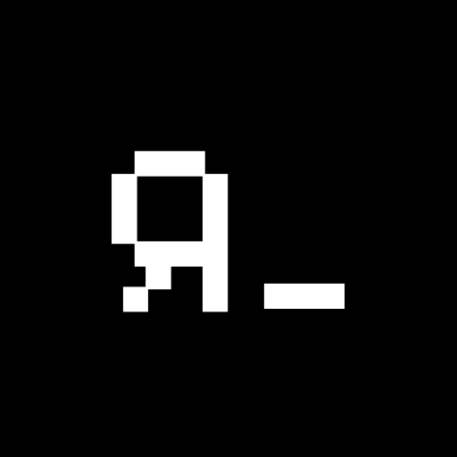

# rapidcraft

Enterprise-first JSON blueprint scaffolding CLI for RapidKit.



## Usage

- npx rapidcraft@latest init my-app --preset enterprise-dashboard
- pnpm dlx rapidcraft@latest init my-app --preset operations-console
- npx rapidcraft@latest init my-app --preset enterprise-dashboard --deployment netlify
- npx rapidcraft@latest init my-app --preset operations-console --deployment kubernetes
- npx rapidcraft@latest init my-app --preset enterprise-dashboard --skip-deployment

## Commands

- rapidcraft list-presets
- rapidcraft init <project-name> [--preset <id>] [--output <path>] [--deployment <target>] [--skip-deployment]

## Output Model

- Presets scaffold JSON blueprint manifests only.
- Generated projects are intended for AI/MCP-driven implementation workflows.
- No React application code is scaffolded by default.
- Blueprint manifests record deployment target selection for downstream materialization.
- Container-based targets record a required multi-stage Docker build strategy.

## Contributing

### Setup

1. Install dependencies:

```bash
pnpm install
```

2. Ensure git hooks are installed:

```bash
pnpm prepare
```

### Local Quality Checks

Run these before opening a PR:

```bash
pnpm lint
pnpm format:check
pnpm check
```

To auto-fix formatting and lint issues:

```bash
pnpm lint:fix
pnpm format
```

### Commit Convention

This repository enforces Conventional Commits through a commit-msg hook.

Examples:

- feat: add deployment target validation
- fix: handle missing preset contract
- docs: clarify scaffold output model

Invalid commit messages are rejected automatically.
